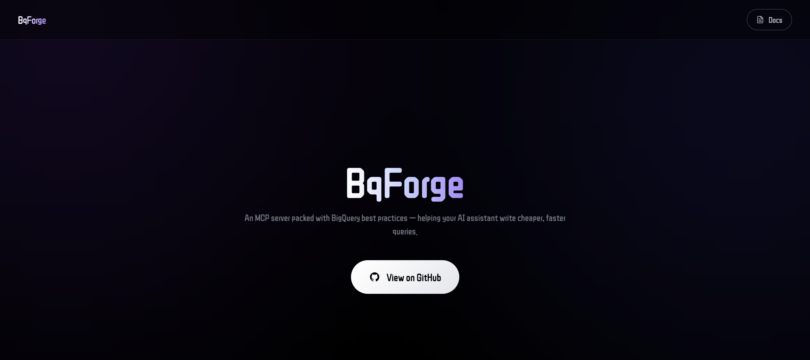

<div align="center">



# QostEx

### BigQuery Best Practices MCP Server


A Model Context Protocol (MCP) server that brings curated BigQuery best practices and live GCP intelligence directly into Claude and other MCP-compatible AI clients.

**[Live Site](https://sreekanth-kc.github.io/BqForge-FE/)**

</div>

---

## What It Does

QostEx gives Claude two things:

- **81 curated best practices** across 13 categories — partition design, cost control, schema, security, and more
- **32 live GCP tools** — query review, dry-run cost estimation, table profiling, job management, schema drift detection, and more

Just configure a system prompt once. Claude automatically pulls the right practices and runs the right checks as you work.

---

## Best Practice Categories

| Category | Practices | ID Prefix |
|---|:---:|:---:|
| Query Optimization | 6 | `QO-xxx` |
| Schema Design | 5 | `SD-xxx` |
| Cost Management | 5 | `CO-xxx` |
| Security & Access Control | 5 | `SE-xxx` |
| Materialized Views | 5 | `MV-xxx` |
| Monitoring & Observability | 5 | `MO-xxx` |
| Workload Management | 5 | `WM-xxx` |
| Data Ingestion | 5 | `DI-xxx` |
| Partitioning | 4 | `PT-xxx` |
| BI Engine | 3 | `BE-xxx` |
| Storage Pricing | 3 | `SP-xxx` |
| Authorized Views | 4 | `AV-xxx` |
| Scheduled Queries | 5 | `SQ-xxx` |

> **81 practices total** across 13 categories

---

## Installation

```bash
git clone https://github.com/sreekanth-kc/BqForge.git
cd QostEx

python3 -m venv .venv
source .venv/bin/activate        # Windows: .venv\Scripts\activate

pip install -r requirements.txt
```

---

## Claude Desktop Setup

Add to `~/Library/Application Support/Claude/claude_desktop_config.json`:

```json
{
  "mcpServers": {
    "qostex": {
      "command": "/absolute/path/to/.venv/bin/python",
      "args": ["/absolute/path/to/QostEx/server.py"]
    }
  }
}
```

To enable live GCP tools, add your credentials:

```json
{
  "mcpServers": {
    "qostex": {
      "command": "/absolute/path/to/.venv/bin/python",
      "args": ["/absolute/path/to/QostEx/server.py"],
      "env": {
        "GCP_SERVICE_ACCOUNT_JSON": "/path/to/service-account.json",
        "GOOGLE_CLOUD_PROJECT": "your-project-id"
      }
    }
  }
}
```

Restart Claude Desktop after saving.

---

## GCP Authentication

QostEx tries credentials in this order:

1. `GCP_SERVICE_ACCOUNT_JSON` — path to a service account JSON file
2. `GOOGLE_APPLICATION_CREDENTIALS` — standard GCP env var
3. Application Default Credentials (`gcloud auth application-default login`)

GCP tools are disabled but all best-practice tools remain available when no credentials are configured.

---

## Activating in Prompts

Paste the system prompt snippet into your Claude Project instructions:

```
Resource URI: bigquery://prompt
```

Or simply tell Claude:

```
use qostex best practices
```

Claude will automatically call `resolve_topic` → `get_practices` whenever BigQuery topics arise.

---

## Available Tools

### Practice & Knowledge Tools

| Tool | Description |
|---|---|
| `resolve_topic` | Resolve a natural-language question to ranked practice IDs |
| `get_practices` | Fetch focused practice content within a token budget |
| `get_best_practices` | Retrieve all practices for a category |
| `search_practices` | Full-text keyword search across all practices |
| `get_practice_detail` | Get full detail for a single practice by ID |
| `list_all_practice_ids` | Compact list of every practice ID and title |

### Query Analysis Tools

| Tool | Description |
|---|---|
| `review_query` | Analyse a SQL query for best-practice violations (static) |
| `review_query_with_schema` | Schema-aware review: fetches real partition/cluster info, checks JOIN order by actual table size, estimates full-scan cost |
| `dry_run_query` | Estimate bytes processed and cost before running |
| `estimate_query_cost` | Cost estimate with configurable price per TB |
| `explain_query_plan` | Fetch the BigQuery query execution plan |

### Schema & Table Tools

| Tool | Description |
|---|---|
| `explore_schema` | List datasets, tables, or columns in a project |
| `get_table_info` | Table metadata: schema, row count, size, partitioning, clustering |
| `profile_table` | Column-level statistics via TABLESAMPLE |
| `detect_schema_drift` | Compare current schema against a stored snapshot |
| `suggest_schema_improvements` | Recommend partitioning, clustering, and type changes |
| `compare_tables` | Row count and schema diff between two tables |
| `list_materialized_views` | List all materialized views in a dataset |

### Query Execution Tools

| Tool | Description |
|---|---|
| `execute_query` | Run a SQL query and return results |
| `list_jobs` | List recent BigQuery jobs with status |
| `cancel_job` | Cancel a running job by job ID |

### Monitoring & Intelligence Tools

| Tool | Description |
|---|---|
| `query_history` | Recent query history from INFORMATION_SCHEMA |
| `get_expensive_queries` | Top queries by bytes processed |
| `get_cost_attribution` | Cost breakdown by label, user, or dataset |
| `get_slot_utilization` | Slot usage over time |
| `check_data_freshness` | Last modified time for tables |
| `check_gcp_connection` | Verify credentials and project connectivity |

### Advanced Diagnostics

| Tool | Description |
|---|---|
| `detect_zombie_queries` | Find long-running queries likely to time out or waste slots |
| `detect_performance_regression` | Compare recent vs historical query performance using MD5 fingerprinting |
| `map_table_lineage` | Trace upstream and downstream table dependencies |

---

## How Query Review Works

`review_query` runs static checks on any SQL — no GCP connection needed:

- `SELECT *` detection
- Missing partition filter
- Cartesian JOIN detection
- `COUNT(DISTINCT)` scalability warning
- Nested subquery depth
- JOIN order heuristics

`review_query_with_schema` goes further by connecting to BigQuery:

- Fetches actual partition and cluster columns for every table in the query
- Fetches real table sizes and flags suboptimal JOIN order
- Checks the WHERE clause against the real partition column (not just any date column)
- Reports estimated cost of a full scan if the partition filter is missing

---

## Example Prompts

```
What are BigQuery partitioning best practices?
→ resolve_topic("partitioning") → get_practices(...)

Review this query for issues:
SELECT * FROM orders o JOIN users u ON o.user_id = u.id WHERE o.date > '2024-01-01'
→ review_query_with_schema(sql="...", project="my-project")

How much will this query cost?
→ dry_run_query(sql="...", project="my-project")

Show me the most expensive queries this week
→ get_expensive_queries(project="my-project", days=7)

Are there any zombie queries running right now?
→ detect_zombie_queries(project="my-project")

Has this table's schema changed since last week?
→ detect_schema_drift(project="my-project", dataset="analytics", table="events")
```

---

## Project Structure

```
QostEx/
├── server.py                      # MCP server — tool registry and dispatch
├── gcp_tools.py                   # Live GCP tool implementations
├── gcp_client.py                  # BigQuery client with auth fallback chain
├── sql_parser.py                  # sqlparse-based comment stripping and SQL analysis
├── data/
│   ├── query_optimization.py      # QO-xxx (6 practices)
│   ├── schema_design.py           # SD-xxx (5 practices)
│   ├── cost_management.py         # CO-xxx (5 practices)
│   ├── security.py                # SE-xxx (5 practices)
│   ├── materialized_views.py      # MV-xxx (5 practices)
│   ├── monitoring.py              # MO-xxx (5 practices)
│   ├── workload_management.py     # WM-xxx (5 practices)
│   ├── data_ingestion.py          # DI-xxx (5 practices)
│   ├── partitioning.py            # PT-xxx (4 practices)
│   ├── bi_engine.py               # BE-xxx (3 practices)
│   ├── storage_pricing.py         # SP-xxx (3 practices)
│   ├── authorized_views.py        # AV-xxx (4 practices)
│   └── scheduled_queries.py       # SQ-xxx (5 practices)
├── requirements.txt
├── pyproject.toml
├── FEATURES.md                    # Full tool and practice reference
└── USER_GUIDE.md                  # Installation, auth, and usage guide
```

---

## Environment Variables

| Variable | Default | Description |
|---|---|---|
| `GCP_SERVICE_ACCOUNT_JSON` | — | Path to service account JSON file |
| `GOOGLE_CLOUD_PROJECT` | — | Default GCP project ID |
| `BQ_PRICE_PER_TB` | `6.25` | On-demand query price per TB processed |

---

## Available Resources

| URI | Description |
|---|---|
| `bigquery://overview` | High-level overview of all categories |
| `bigquery://prompt` | System prompt snippet for Claude projects |
| `bigquery://query_optimization` | Query optimisation practices (JSON) |
| `bigquery://schema_design` | Schema design practices (JSON) |
| `bigquery://cost_management` | Cost management practices (JSON) |
| `bigquery://security` | Security & access control practices (JSON) |
| `bigquery://materialized_views` | Materialized views practices (JSON) |
| `bigquery://monitoring` | Monitoring & observability practices (JSON) |
